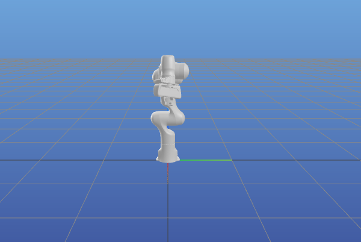
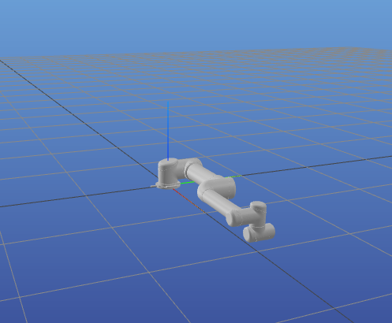

Example of using ``example_robot_data`` package
=====================================================

Using ``example-robot-data``  package provided by pinocchio in order to load models quikcly `github link <https://github.com/Gepetto/example-robot-data>`_.

Example with Franka Emika Panda
-------------------------------

.. code-block:: python
    
    import numpy as np
    import os

    import pynocchio as pynoc
    import time

    from example_robot_data import load

    robot = pynoc.RobotWrapper(robot_wrapper=load('panda'))

    q0 = (robot.q_min+robot.q_max)/2

    robot.update_joint_data(q=q0)
    robot.update_visualisation()

Example with UR5
-------------------------------

.. code-block:: python
    
    import numpy as np
    import os

    import pynocchio as pynoc
    import time

    from example_robot_data import load

    robot = pynoc.RobotWrapper(robot_wrapper=load('ur5'))

    q0 = (robot.q_min+robot.q_max)/2

    robot.update_joint_data(q=q0)
    robot.update_visualisation()

Example with Talos humanoid
-------------------------------

.. code-block:: python
    
    import numpy as np
    import os

    import pynocchio as pynoc
    import time

    from example_robot_data import load

    robot = pynoc.RobotWrapper(robot_wrapper=load('talos'))

    q0 = (robot.q_min+robot.q_max)/2

    robot.update_joint_data(q=q0)
    robot.update_visualisation()

