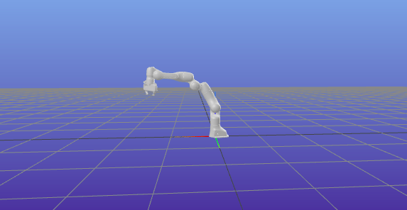
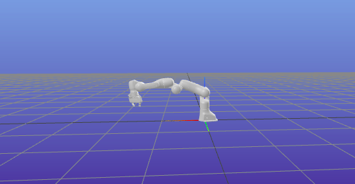

Create a reduced robot model by fixing joints
=====================================================

Using ``example-robot-data``  package provided by pinocchio in order to load models quikcly `github link <https://github.com/Gepetto/example-robot-data>`_.

.. code-block:: python
        
    import numpy as np
    import pynocchio as pynoc
    from example_robot_data import load
    import meshcat
    import time

    # build the robot wrapper
    panda = pynoc.RobotWrapper(robot_wrapper=load('panda'), 
                                robot_name="panda1", 
                                fix_joints=[1,3,5,6,7,8,9],
                                q=np.array([0,0,0,0,0,1.57,0,0.05,0.05]))

    # if in jupyter notebook, use this line 
    robot.viz.viewer.jupyter_cell()

    # Generate random initial joint position and velocity
    q0 = np.random.uniform(panda.q_min, panda.q_max)

    # update visualizer
    panda.update_visualisation(np.array([0.5,-1]))

    print("robot has {} joints".format(panda.n))

.. code-block:: python
        
    panda.update_visualisation(np.array([1.2,-0.5]))

