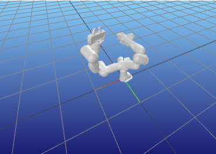

Example of displaying multiple robots
=====================================================

Using ``example-robot-data``  package provided by pinocchio in order to load models quikcly `github link <https://github.com/Gepetto/example-robot-data>`_.

Example with Franka Emika Panda
-------------------------------

.. code-block:: python
    
    import numpy as np
    import pynocchio as pynoc
    from example_robot_data import load
    import meshcat
    import time

    # define the common visualizer
    viewer = meshcat.Visualizer()
    # if in jupyter notebook, use this line 
    viewer.jupyter_cell()

    # load two panda robots 
    # important: the robot_name must be unique otherwise the visualisation will be overwritten
    # provide the viewer to both robots
    robot = pynoc.RobotWrapper(robot_wrapper=load('panda'), robot_name="panda0", viewer=viewer)
    robot1 = pynoc.RobotWrapper(robot_wrapper=load('panda'), robot_name="panda1", viewer=viewer)

    # set the initial joint position for both robots
    robot.update_visualisation(np.random.uniform(robot1.q_min,robot1.q_max))
    robot1.update_visualisation(np.random.uniform(robot1.q_min,robot1.q_max))

    # optional pause if not in jupyter 
    time.sleep(10)

