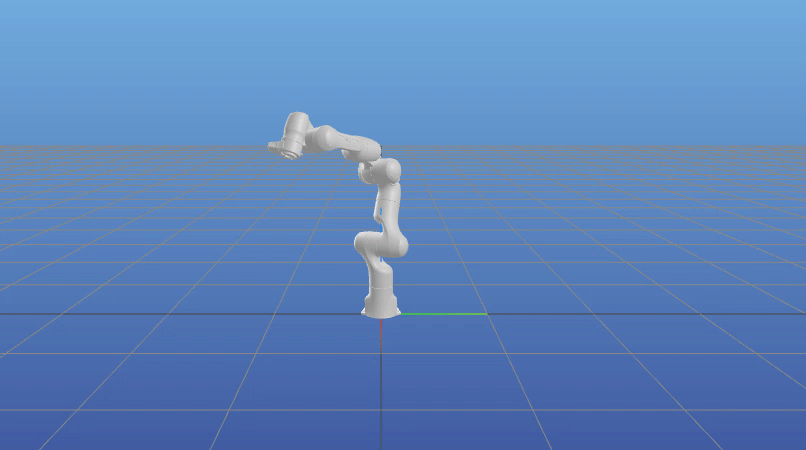

Animation in Meshcat
=====================================================

This code uses the PyNocchio library to visualise the robot in Meshcat vievew in real-time

.. code-block:: python
    
    import numpy as np
    import os

    import pynocchio as pynoc
    import time

    dir_path = os.path.dirname(os.path.abspath(pynoc.__file__))
    panda = pynoc.RobotWrapper(urdf_path= dir_path+"/models/urdf/panda.urdf", mesh_path=dir_path+"/models", q=np.zeros(7))

    q0 = (panda.q_min+panda.q_max)/2

    panda.update_joint_data(q=q0)
    panda.update_visualisation()

    while True:
        for i in np.sin(np.linspace(-np.pi,np.pi,200)):
            q0[0] = i
            q0[1] = i
            q0[2] = i
            panda.update_joint_data(q=q0)
            panda.update_visualisation()
            time.sleep(0.03)

